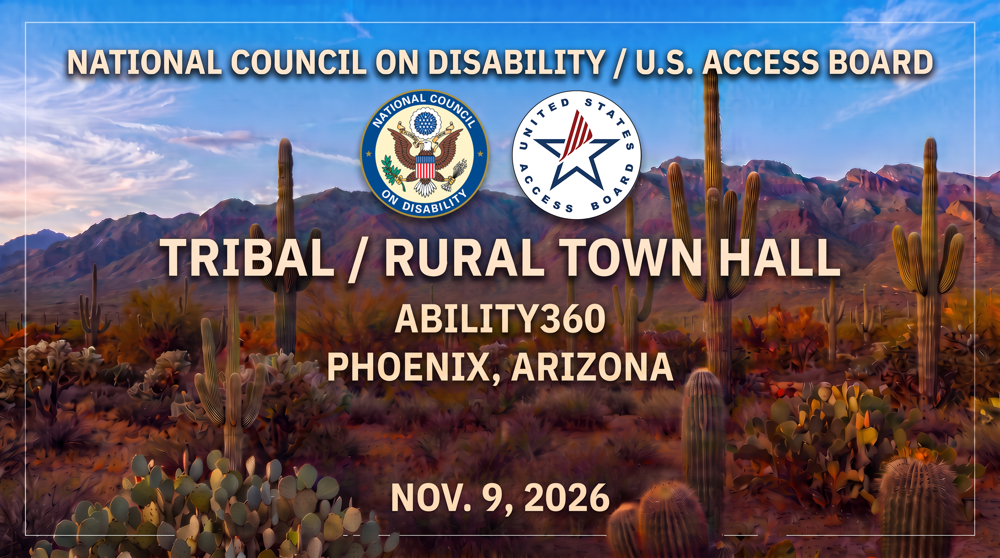

#### Join the National Council on Disability and the U.S. Access Board for a Tribal and Rural Town Hall in Phoenix, Arizona on November 9.

## Date: Nov. 9, 2026

Time: 8:30 a.m. - 4:30 p.m. Mountain Standard Time (MST)

## Location: Ability 360

5025 E. Washington St.
Phoenix, AZ 85034

## **[Info/Registration](<>)** on NCD's Eventbrite page for in-person or online participation.

### Lunch will be provided for in-person attendees.

### Space is limited so register today!

### Share your Tribal and rural community perspectives on:

* ### Housing
* ### Employment
* ### Education
* ### Independent Living
* ### Healthcare
* ### Transportation

## Agenda

8:30 – 9:30 a.m. – Networking and Sign-In

9:30 – 9:35 a.m. – NCD Welcome, Call to Order

9:35 – 9:40 a.m. – Tribal Land acknowledgment

9:40 – 10:20 a.m. Local / Tribal Welcomes NCD and Attendees, Posting of Colors

10:20 – 10:40 a.m. - NCD Opening remarks, Introduction of Access Board Executive Director and Chair

10:40 – 11:10 a.m. - Panel Discussion and Presentation on NCD's Incidents of Disabilities and Accessibility on Tribal Land report

11:10 – 11:30 a.m. – BREAK

**11:30 – 11:40 a.m. – Town Hall Introduction**

**11:40 a.m. – 12:40 p.m. – Town Hall**

12:40 – 2:00 p.m. – Lunch Break (lunch provided to in-person attendees)

**2 – 4:30 p.m. – Town Hall Continued**

4:30 p.m. – Closing Remarks, NCD Meeting Adjournment

To receive updates on the November 9 Tribal and Rural Town Hall and the ongoing work of both agencies, sign up for their communications lists at the following links: 

[NCD.gov/subscribe](https://www.ncd.gov/subscribe/) and A[ccess-Board.gov/contact](https://www.access-board.gov/contact)
